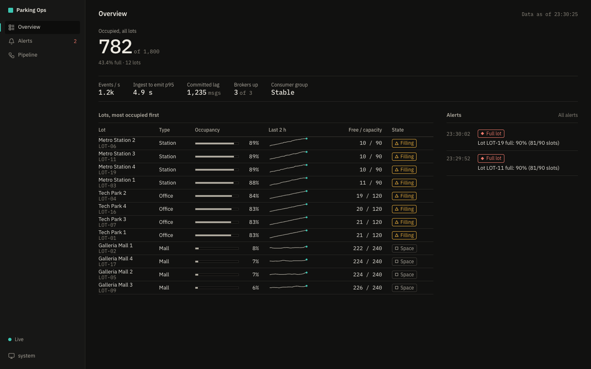
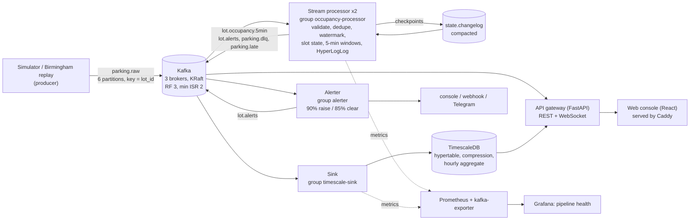

# Smart Parking Occupancy Analytics

Stream Processing and Analytics (AI372IA). Parking sensors emit events to **Apache Kafka**; a stream
processor validates, de-duplicates and windows them in event time; results land in **TimescaleDB**; a live
operator console shows occupancy, alerts and the health of the stream itself.



## Architecture



## Quick start

Requires Docker with Compose v2.24+ (8 GB RAM recommended).

```bash
cp .env.example .env
make up            # builds images, starts everything, waits for health (about 2 minutes the first time)
```

| What | Where |
|---|---|
| Operator console (Overview, Lot detail, Alerts, Pipeline) | http://localhost:8081/ |
| Grafana "Pipeline health" (admin / `GRAFANA_PASSWORD`, default `admin` in dev) | http://localhost:8081/grafana/ |
| API and OpenAPI docs | http://localhost:8080/docs |
| Prometheus | http://localhost:9090 |

Data appears within a minute: the simulator replays a weekday morning at 20x, so lots fill and full-lot alerts fire
within about ten minutes. Before a demo, run `make demo-reset` (see [docs/DEMO.md](docs/DEMO.md)).

Useful targets: `make test`, `make lint`, `make type`, `make test-integration`, `make chaos` (six failure drills),
`make load-test`, `make hll-accuracy`, `make openapi`. Frontend: `cd web && pnpm install && pnpm test && pnpm dev`.

## Delivery semantics (stated precisely)

The processor gives **at-least-once processing**: it produces outputs, flushes, writes a checkpoint to the
compacted `state.changelog`, then commits offsets, so a crash replays events since the last checkpoint. Stored
results are **effectively-once** because the sink upserts on `(lot_id, window_start)` and never lets a closed window
be reopened. This is **not** Kafka exactly-once semantics (transactions). See [DECISIONS D10](docs/DECISIONS.md).

## Design rationale (short)

- Own windowing logic, no stream framework, so every rule is explainable line by line
  (`processor/lot_state.py`): event-time tumbling windows, watermark = max event time minus allowed lateness,
  a window closes when `end + grace` is behind the watermark, late events go to `parking.late`.
- Time-weighted occupancy, entries/exits, and **HyperLogLog** for distinct vehicles (1 KiB per window instead of a set
  that grows with traffic: worst error 7.57% at 1M vehicles against a 9.75% bound, versus 88 MB exact).
- Fault tolerance by checkpoint/restore and idempotent sinks; six failure drills run and pass (broker SIGKILL,
  processor SIGKILL, 60 s database outage, malformed data, late/duplicate data, lag spike).
- Lot IDs are chosen so they hash evenly across the 6 partitions (D6); the alerter is a single instance by design (D17).
- Every decision, with alternatives, is in [docs/DECISIONS.md](docs/DECISIONS.md); every measurement, including the
  mistakes made while measuring, is in [docs/RESULTS.md](docs/RESULTS.md).

## How each circular requirement is satisfied

| Requirement | Where |
|---|---|
| Kafka is the central platform | 3-broker KRaft cluster `docker-compose.yml`; all services talk only through topics |
| Producer and consumer | `simulator/` produces; `processor/`, `sink/`, `alerter/`, `api/` consume |
| At least two topics | 7 topics, `infra/create_topics.sh` |
| Partitioning and consumer groups | `parking.raw` 6 partitions keyed by `lot_id`; three groups; live rebalance on the Pipeline screen |
| Window-based operation | tumbling 5-minute event-time windows, `processor/lot_state.py` |
| Aggregation / summarisation | time-weighted average, entries/exits, HyperLogLog, `processor/hll.py` |
| Fault tolerance / recovery | checkpoint + restore, `scripts/chaos_*.py` |
| Database / time-series store | TimescaleDB, `infra/timescale/init.sql`, `sink/db.py` |
| Real-time visualisation or alerts | `web/` console, Grafana dashboard, `alerter/` |

Line-by-line evidence with file and function: [docs/CIRCULAR_CHECKLIST.md](docs/CIRCULAR_CHECKLIST.md).

## Repository map

`common/` schemas and Kafka helpers, `simulator/` producer with fault injection, `processor/` stream processing,
`sink/` Kafka to TimescaleDB, `alerter/`, `api/` FastAPI gateway, `web/` React console (design system in
`web/src/ui/`), `infra/` topic init, SQL, Prometheus, Grafana, Caddy, backup, `scripts/` chaos, load and accuracy
tests, `tests/` unit and integration, `docs/`.

## CI

Every push runs: ruff, mypy (strict on `common/` and `processor/`), pytest; a full-stack integration test that starts
the Compose stack and asserts exact rows in TimescaleDB and through the API/WebSocket; frontend type-check, lint,
component tests, build and a 200 kB bundle budget; a Playwright test against the live stack that checks real data
is flowing into the UI. Pushes to `main` build and push five multi-arch images to GHCR.

## Docs

[DEMO](docs/DEMO.md) · [DEPLOY](docs/DEPLOY.md) · [DECISIONS](docs/DECISIONS.md) · [RESULTS](docs/RESULTS.md) ·
[CIRCULAR_CHECKLIST](docs/CIRCULAR_CHECKLIST.md) · [RUBRIC_MAPPING](docs/RUBRIC_MAPPING.md) · [METRICS](docs/METRICS.md)
